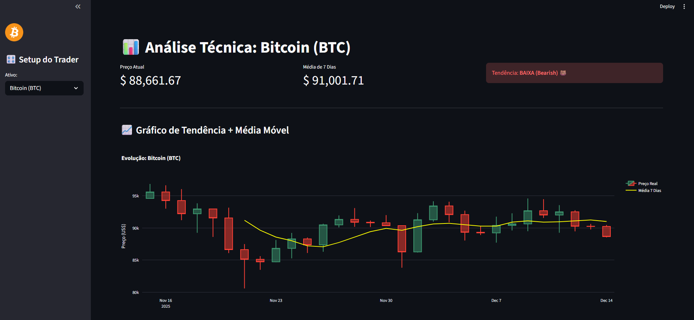

# 📈 AI Trader: Dashboard Financeiro em Tempo Real

## 💼 Visão de Negócio
No mercado financeiro, segundos custam milhões. O objetivo deste projeto foi desenvolver uma ferramenta de **Business Intelligence (BI)** capaz de monitorar ativos globais (Bitcoin, Ethereum, Solana) em tempo real, eliminando o delay de plataformas convencionais e auxiliando na tomada de decisão rápida.

## 🛠️ Arquitetura da Solução
O sistema foi construído 100% em Python, utilizando uma arquitetura de microsserviços simples:
1.  **Extração (ETL):** Conexão direta com a **API Pública da Binance** para captura de dados de preço e volume (Streaming).
2.  **Processamento:** Cálculo automático de indicadores técnicos (Médias Móveis de 7 períodos) usando `Pandas`.
3.  **Visualização:** Interface interativa via `Streamlit` e Gráficos de Velas (Candlestick) com `Plotly`.
4.  **Inteligência:** Algoritmo de decisão que sugere "Tendência de Alta" ou "Baixa" baseada no cruzamento de médias.

## 📊 Features
* Monitoramento Live (Atualização sob demanda).
* Gráficos Interativos (Zoom, Pan, Detalhes).
* Alertas visuais de tendência (Bullish/Bearish).

## 🖼️ Preview do Dashboard

## 🚀 Como Rodar Localmente
1.  Clone o repositório.
2.  Instale as dependências: `pip install -r requirements.txt`
3.  Execute o servidor: `streamlit run app.py`

---
**Autor:** Vitor Barbosa - www.linkedin.com/in/vlbarbosa
